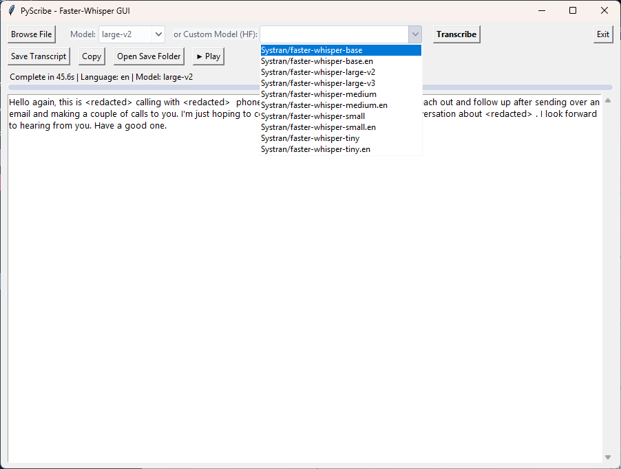

# PyScribe - Local Transcription GUI

PyScribe is a modern, Windows-friendly GUI application for fast, local audio/video transcription using the powerful `faster-whisper` library. It's designed to provide a seamless and efficient transcription workflow, running entirely on your own hardware for maximum privacy and performance.



*Users can choose between standard multilingual models or specialized English-only models from Hugging Face.*

---

## Key Features

- **High-Speed Transcription:** Powered by `faster-whisper` for significant speed improvements over the original Whisper, especially on GPUs.
- **Hardware-Aware:** Automatically detects your GPU (NVIDIA/CUDA) or CPU and recommends the optimal model size for your hardware.
- **Live Progress & Transcription:** Watch the transcription appear in real-time and monitor progress with a live percentage bar.
- **Audio Playback & Cancellation:** Preview your audio files with a built-in player (Play/Stop) and cancel a transcription mid-process if it's taking too long.
- **Automatic Language Detection:** Detects the language of the audio and offers to translate to English if a non-English language is found.
- **Flexible Model Selection:**
    - Choose from standard Whisper models (`tiny`, `base`, `small`, `medium`, `large-v3`).
    - Select from a curated list of fine-tuned, `faster-whisper`-compatible models from Hugging Face.
    - Automatically caches and lists previously downloaded custom models for easy reuse.
- **Detailed Reporting:** Get a full summary upon completion, including time taken, detected language, and the model used.
- **Smart File Naming:** Automatically saves transcripts with a detailed, sortable filename that includes the timestamp and model name, perfect for A/B testing models.
- **User-Friendly Setup:** Automatically checks for missing dependencies and offers to install them on the first run.

---

## Requirements

- **Python 3.11 (Recommended):** This version is confirmed to be compatible with the GPU-enabled version of PyTorch.
- **FFmpeg:** Must be installed and available in your system's PATH. You can install it easily on Windows with `winget install Gyan.FFmpeg`.

---

## Installation (One-Time Setup)

This guide explains how to set up the project using an external virtual environment, which is a best practice to keep dependencies separate from the source code.

1.  **Download and Extract:** Download the project ZIP from GitHub and extract the `PyScribe-main` folder to your desired location (e.g., `C:\Code\PyScribe-main`).

2.  **Create an Environments Folder:** It's recommended to create a central folder to hold your virtual environments. For example, `C:\Code\_envs`.

3.  **Create the Virtual Environment:** Open a terminal and run the following command to create a new virtual environment specifically for this project.
    ```bash
    # Replace the path with your chosen environments folder
    py -3.11 -m venv C:\Code\_envs\pyscribe
    ```

4.  **Activate the Environment:**
    ```bash
    C:\Code\_envs\pyscribe\Scripts\activate
    ```

5.  **Navigate to Project Folder:** In the same terminal, change to the directory where you extracted the project files.
    ```bash
    cd C:\Code\PyScribe-main
    ```

6.  **Install Dependencies:** Choose one of the following two paths.

    ---
    ### For Users with NVIDIA GPUs (Recommended)

    This two-step process ensures you get the best performance.

    **A. Install GPU-Enabled PyTorch:** Run the official command to install PyTorch with CUDA support. This version is for CUDA 12.1.
    ```bash
    pip install torch torchvision torchaudio --index-url [https://download.pytorch.org/whl/cu121](https://download.pytorch.org/whl/cu121)
    ```

    **B. Install Remaining Packages:**
    ```bash
    pip install -r requirements.txt
    ```
    *(Pip will see that PyTorch is already installed and will skip it.)*

    ---
    ### For Users without GPUs (CPU-Only)

    If you do not have an NVIDIA GPU, you only need to run this single command.
    ```bash
    pip install -r requirements.txt
    ```
    *(The application will automatically run in CPU mode.)*

---

## Usage

Simply double-click the **`launch.bat`** file inside the project folder. It will automatically find the external virtual environment and start the application.

---

## Troubleshooting

-   **`ModuleNotFoundError` on launch:** This means the required packages were not installed correctly. Make sure you have activated your virtual environment before running `pip install -r requirements.txt`.
-   **App runs in "CPU Mode" on an NVIDIA system:** This happens when the CPU-only version of PyTorch is installed. To fix this, activate your virtual environment and run the two-step process to replace it with the GPU version:
    ```bash
    pip uninstall torch
    pip install torch torchvision torchaudio --index-url [https://download.pytorch.org/whl/cu121](https://download.pytorch.org/whl/cu121)
    ```

---

## License

This project is licensed under the terms of the GNU GPLv3.
