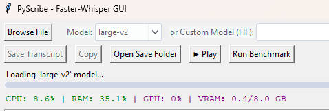
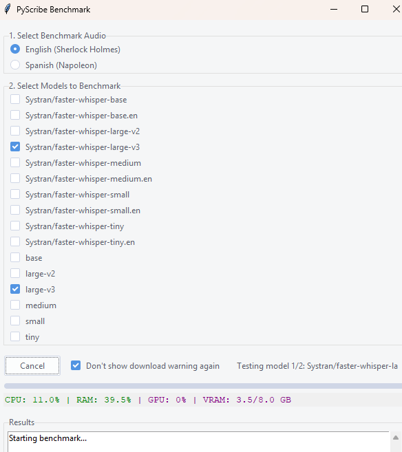

# PyScribe - Local Transcription GUI

PyScribe is a modern, Windows-friendly GUI application for fast, local audio/video transcription using the powerful `faster-whisper` library. It's designed to provide a seamless and efficient transcription workflow, running entirely on your own hardware for maximum privacy and performance.

**Screenshot showing HF Model selection:**


**Screenshot showing Whisper model selection:**


**Screenshot showing metrics during transcription:**



---

## Key Features

- **High-Speed Transcription:** Powered by `faster-whisper` for significant speed improvements over the original Whisper, especially on GPUs.
- **Hardware-Aware:** Automatically detects your GPU (NVIDIA/CUDA) or CPU and recommends the optimal model size for your hardware.
- **Live Progress & Transcription:** Watch the transcription appear in real-time and monitor progress with a live percentage bar.
- **Live Hardware Monitoring:** View real-time CPU, RAM, GPU, and VRAM usage directly in the app during transcription.
- **Audio Playback & Cancellation:** Preview your audio files with a built-in player (Play/Stop) and cancel a transcription mid-process if it's taking too long.
- **Automatic Language Detection:** Transcribes audio in its detected language.
- **English Override:** For multi-language audio, you can force transcription in English when using an English-only model.
- **Built-in Benchmark Tool:** Test the performance of different models on your hardware using standardized audio files to find the best balance of speed and accuracy for your system.
- **Flexible Model Selection:**
    - Choose from standard Whisper models (`tiny`, `base`, `small`, `medium`, `large-v3`).
    - Select from a curated list of fine-tuned, `faster-whisper`-compatible models from Hugging Face.
    - Automatically caches and lists previously downloaded custom models for easy reuse.
- **Detailed Reporting:** Get a full summary upon completion, including time taken (HH:MM:SS), detected language, and the model used.
- **Smart File Naming:** Automatically saves transcripts with a detailed, sortable filename that includes the timestamp and model name.

---

## Benchmark Tool

The application includes a powerful benchmark tool to test and compare the performance of different models on your specific hardware.

**Screenshot showing the benchmark tool:**



---

## Requirements

- **Python 3.12 (Recommended):** This version is confirmed to be compatible with the required libraries.
- **FFmpeg:** Must be installed and available in your system's PATH. You can install it easily on Windows with `winget install Gyan.FFmpeg`.

---

## Installation (One-Time Setup for Windows)

This guide explains how to set up the project using an external virtual environment.

1.  **Install FFmpeg:** Open a terminal and run: `winget install Gyan.FFmpeg`
2.  **Download and Extract:** Download the project ZIP from GitHub and extract it to a folder (e.g., `C:\Code\PyScribe`).
3.  **Create an Environments Folder:** Create a central folder for your virtual environments, for example, `C:\Code\_envs`.
4.  **Create the Virtual Environment:** In a terminal, run the following command:
    ```bash
    # Replace the path with your chosen environments folder
    py -3.12 -m venv C:\Code\_envs\pyscribe
    ```
5.  **Activate the Environment:**
    ```bash
    C:\Code\_envs\pyscribe\Scripts\activate
    ```
6.  **Navigate to Project Folder:** In the same terminal, change to your project directory.
    ```bash
    cd C:\Code\PyScribe
    ```
7.  **Install Dependencies:** Choose one of the following two paths.

    ---
    ### For Users with NVIDIA GPUs (Recommended)

    **A. Install GPU-Enabled PyTorch:**
    ```bash
    pip install torch torchvision torchaudio --index-url [https://download.pytorch.org/whl/cu121](https://download.pytorch.org/whl/cu121)
    ```

    **B. Install Remaining Packages:**
    ```bash
    pip install -r requirements.txt
    ```
    ---
    ### For Users without GPUs (CPU-Only)
    ```bash
    pip install -r requirements.txt
    ```

---

## Usage

Simply double-click the **`launch.bat`** file inside the project folder. It will automatically find the external virtual environment and start the application.

---

## License

This project is licensed under the terms of the GNU GPLv3.

---

## Acknowledgments

The benchmark audio files used in this project are public domain recordings from [LibriVox](https://librivox.org/).
