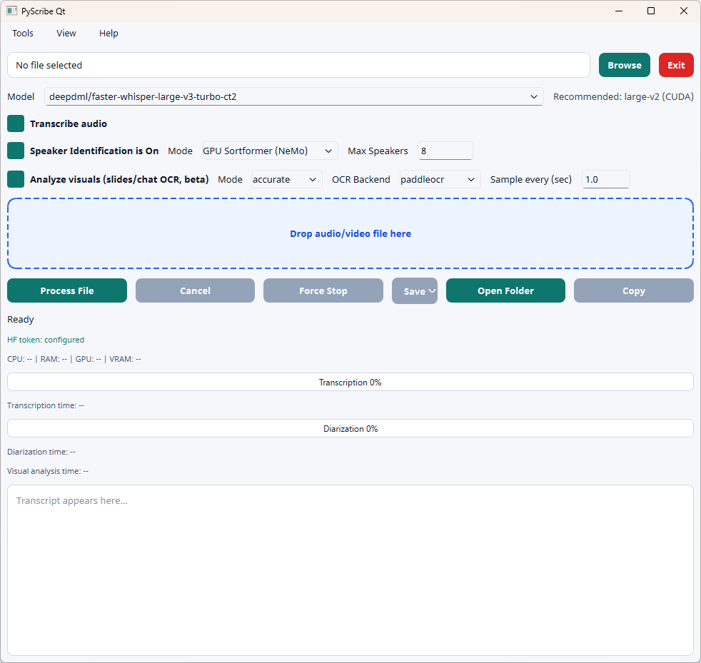
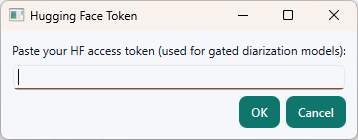
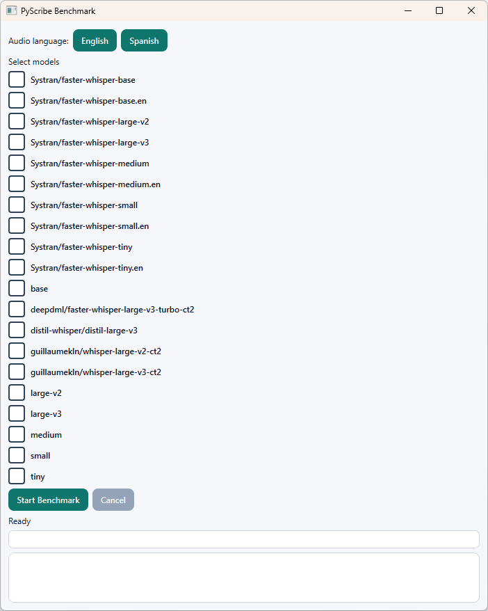
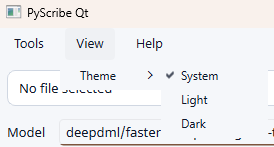
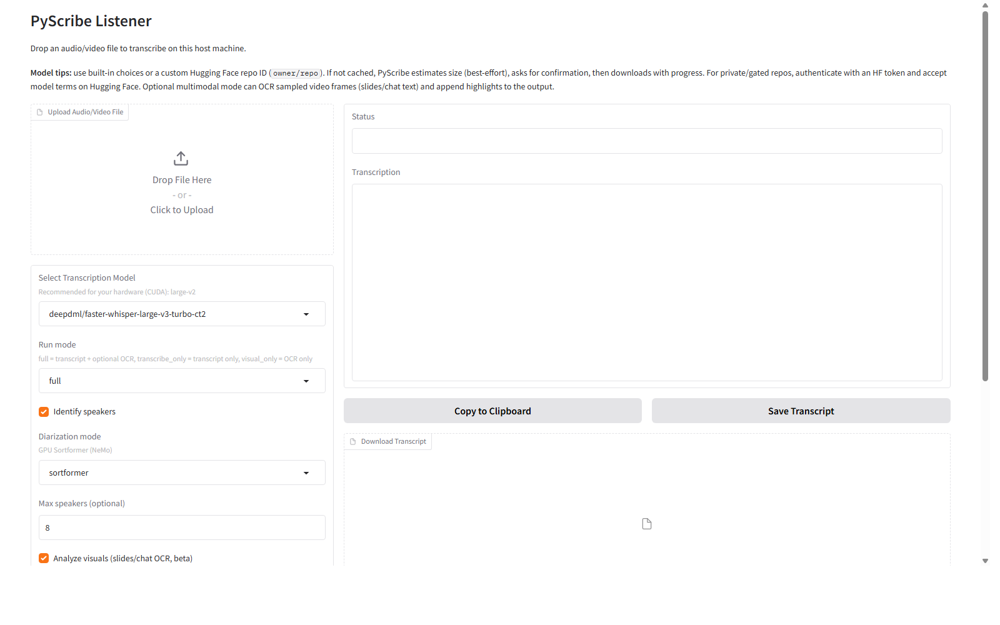

# PyScribe

PyScribe is a local transcription app for Windows and Linux built on `faster-whisper`.
It supports both a Qt desktop UI and a Gradio listener UI, with optional speaker diarization and optional visual OCR analysis for video files.

## Documentation

- `docs/user_guide.md` - full feature guide for Qt, Listener, CLI, and environment settings.
- `docs/qt_help.md` - in-app Qt help content.
- `CONTRIBUTING.md` - development and contribution workflow.
- `SECURITY.md` - vulnerability reporting and security guidance.
- `CHANGELOG.md` - project change history.

## Highlights

- Local transcription using `faster-whisper`
- Hardware-aware model recommendations
- Qt desktop mode and Gradio listener mode
- Qt unified dashboard layout with left navigation and stacked workspaces
- Qt live transcription mode for microphone or loopback capture (Linux-first)
- Qt batch transcription queue for sequential processing of multiple files or entire folders
- Batch queue support for same-named files from different folders
- Live pause/resume during Qt capture without breaking the current session folder
- Responsive transcription cards (two-column on wide windows, single-column on narrow windows)
- Hide/show controls for the left navigation panel and right status panel
- Optional speaker diarization with selectable backend
- Optional visual analysis (OCR on sampled video frames)
- Live status, progress, and transcript updates
- Real-time terminal-style pipeline log in Qt transcription view
- Qt controls for pause, cancel, and force stop
- Save modes: combined output, transcript-only, OCR-only
- Optional Hugging Face token support for gated/private model access
- Qt LLM connection profiles (local/LAN) with connection diagnostics
- Qt LLM post-processing for current transcript or previously saved transcript files
- Qt LLM split workspace with configuration/attachments panel and structured context/preview/output panes
- LLM generation cancel flow with confirmation and safe close behavior while generation is active
- Listener LLM post-processing panel for template-based processing of current or uploaded transcripts
- User template management (custom prompt templates) and payload preview before send
- Optional screenshot/image attachments with multimodal send or OCR fallback for text-only models
- LLM connection manager with subnet detection + LAN scan and explicit LM Studio provider support

## Screenshots

### Qt Desktop Main Window



### Qt Tools: Hugging Face Token



### Qt Tools: Benchmark



### Qt View: Theme Menu



### Listener (Gradio Web UI)



## Recent Updates (Unreleased)

- Isolated pyannote diarization into a separate spawned subprocess so GPU speaker ID can run cleanly after CUDA ASR models.
- Forced pyannote audio reads to prefer `torchaudio`'s `soundfile` backend to avoid SoX loader crashes on some systems.
- Added Torchaudio 2.9+ / 2.11 compatibility shims for pyannote audio metadata/loading, including `soundfile` fallbacks when `torchaudio.info` or TorchCodec-backed loading is unavailable.
- Fixed empty diarization results being formatted as `[S?]`; PyScribe now keeps the plain transcript when speaker segments are unavailable.
- Improved Qt transcription worker recovery so unexpected child exits surface a real failure instead of leaving the UI stuck.
- Hardened Qt **Force Stop** to escalate from terminate to kill when needed.
- Added Qt live transcription mode with rolling ASR, autosaved capture sessions, microphone/loopback selection, and final post-pass cleanup.
- Added Qt live **Pause / Resume** for microphone/loopback capture while keeping the same session folder and saved audio file.
- Added Qt live GPU memory preflight warnings to catch likely CUDA out-of-memory conditions before capture, especially when LM Studio or another local GPU workload has a large model loaded.
- Live capture audio now uses timestamped `YYYY-MM-DD_HHMMSS-live-capture.wav` filenames by default.
- Fixed Qt live second-session state after a completed final post-pass so Live Capture controls and **Stop** are restored correctly.
- Qt batch queue now allows same-named media files from different folders and shows parent-folder context for duplicate basenames.
- Added confirmation before canceling an active Qt live transcription session.
- Shared listener security/auth logic between `main.py` and `app.py` via `services/listener_security_service.py`.
- Hardened listener credential handling: `--auth-pass` is rejected to avoid secret leakage in process lists/history.
- Throttled live transcript text updates in the transcription pipeline for smoother UI updates during long runs.
- Added regression tests for listener security helpers and diarization backend compatibility.
- Refreshed Qt main window with a sidebar + stacked dashboard layout and modernized light/dark QSS styling.
- Added responsive transcription layout behavior, including startup sizing to available screen and adaptive card columns.
- Added hide/show toggles for left navigation and right status rail in the transcription workspace.
- Added a terminal-style live pipeline log panel in Qt transcription view.
- Refactored Qt LLM post-process dialog into a splitter-based workspace with grouped configuration and output panes.
- Added confirmed-cancel handling for active LLM generation, including close-window cancellation behavior.

## Requirements

- Python 3.10+ (3.12 recommended)
- FFmpeg available in PATH
  - Windows: `winget install Gyan.FFmpeg`
  - Ubuntu/Debian: `sudo apt install ffmpeg`
- Optional OCR runtime:
  - `pytesseract` + OS `tesseract` executable
  - or PaddleOCR runtime dependencies
- Optional Diarization backends:
  - `pyannote.audio` (default, included in core)

## Installation

### Windows

```bash
py -3.12 -m venv .venv
.\.venv\Scripts\activate
pip install -r requirements.txt
```

### Linux

```bash
sudo apt update
sudo apt install -y ffmpeg python3.12 python3.12-venv
python3.12 -m venv .venv
source .venv/bin/activate
pip install -r requirements.txt
```

## Quick Start

```bash
# Interactive launcher menu (choose mode)
python main.py

# Qt desktop
python main.py qt

# Listener mode (localhost by default)
python main.py serve --port 7860
```

Listener mode automatically moves to the next free port if the preferred port is occupied.

Interactive launcher behavior:

- If no option is chosen within 5 seconds, PyScribe automatically starts `1) Desktop (Qt)`.
- Choose `2) Listener` and then:
  - `1) Localhost only (127.0.0.1)` (default)
  - `2) LAN share (0.0.0.0)` with auth enabled
- Interactive LAN uses:
  - Username default: `pyscribe` (override with env var)
  - Password: from `PYSCRIBE_LAN_AUTH_PASS` or secure prompt at launch
- Override username/password with:
  - `PYSCRIBE_LAN_AUTH_USER`
  - `PYSCRIBE_LAN_AUTH_PASS`

## Listener Security

Binding to non-local interfaces is intentionally restricted.

- Local-only bind (safe default): `--host 127.0.0.1`
- Non-local bind requires:
  - `--allow-nonlocal-host`
  - `--auth-user <username>`
  - `PYSCRIBE_AUTH_PASS` environment variable
- Public share mode (`--share`) also requires auth credentials, even on localhost binds.
- Optional: set `PYSCRIBE_AUTH_USER` instead of passing `--auth-user`
- Legacy `--auth-pass` CLI flag is intentionally unsupported

Example:

```bash
PYSCRIBE_AUTH_USER=admin PYSCRIBE_AUTH_PASS=change-me \
python main.py serve --host 0.0.0.0 --allow-nonlocal-host --port 7860
```

Note: Interactive LAN mode no longer uses a default password. Set
`PYSCRIBE_LAN_AUTH_PASS` or enter a prompted password at launch.

## Models

- Built-in model choices are available in both UIs.
- Custom Hugging Face repo IDs are supported (for example `owner/repo`).
- Full Hugging Face model URLs are normalized to repo IDs.
- Qt mode asks for model download confirmation with a size estimate before first download.

## Feature Notes

- **Diarization:** optional; pyannote backends run in an isolated worker process, prefer `soundfile` audio loading, and retry on CPU when GPU diarization is unavailable. Modern Torchaudio compatibility shims provide `soundfile` fallbacks for metadata/loading APIs removed or changed in Torchaudio 2.9+ / 2.11. If diarization fails or produces no speaker segments, transcription completes without speaker labels instead of emitting `[S?]` lines.
- **Qt live mode:** Linux-first desktop feature for microphone or loopback capture. Live mode writes a recoverable timestamped `YYYY-MM-DD_HHMMSS-live-capture.wav` while showing rolling transcript text, supports **Pause / Resume** within the same session, and runs a final file-based cleanup pass when you press **Stop**. Cancel asks for confirmation and preserves the session folder/audio when accepted. Speaker identification, when enabled, runs only in that final pass. Granite remains file-only.
- **Visual analysis:** optional; supports `fast`, `balanced`, `accurate` profiles and OCR backend selection.
- **Qt output save modes:** `Save All`, `Save Transcript Only`, `Save OCR Only`.
- **Benchmarking:** Qt Tools menu includes benchmark runner for bundled sample media.
- **LLM post-processing:** Qt Tools menu includes connection management plus post-process actions.

## Testing

```bash
python -m unittest tests.test_listener_and_diar_backends
```

## CLI / Packaging

```bash
pip install .
pyscribe --help
```

- Listener helper script: `scripts/run_listener.sh`
- systemd example unit: `deploy/systemd/pyscribe-listener.service.example`

## Runtime Environment Defaults

PyScribe configures writable cache defaults for OCR/model assets when needed, including:
`PYSCRIBE_CACHE_DIR`, `PADDLE_HOME`, `PADDLE_PDX_CACHE_HOME`, `HF_HOME`, and `MODELSCOPE_CACHE`.

See `docs/user_guide.md` for all environment variables and behavior.

## License

PolyForm-Noncommercial-1.0.0

Commercial use is not permitted under the current project license.

## Acknowledgments

Benchmark audio source: [LibriVox](https://librivox.org/).
