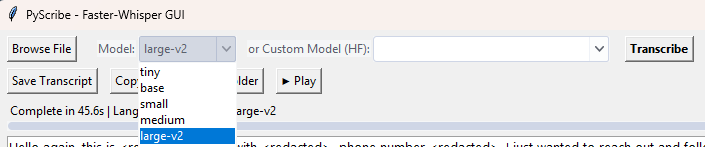

# PyScribe - Local Transcription GUI

PyScribe is a modern, Windows-friendly GUI application for fast, local audio/video transcription using the powerful `faster-whisper` library. It's designed to provide a seamless and efficient transcription workflow, running entirely on your own hardware for maximum privacy and performance.



*Users can choose between standard multilingual models or specialized English-only models from Hugging Face.*

---

## Key Features

- **High-Speed Transcription:** Powered by `faster-whisper` for significant speed improvements over the original Whisper, especially on GPUs.
- **Hardware-Aware:** Automatically detects your GPU (NVIDIA/CUDA) or CPU and recommends the optimal model size for your hardware.
- **Live Progress & Transcription:** Watch the transcription appear in real-time and monitor progress with a live percentage bar.
- **Audio Playback & Cancellation:** Preview your audio files with a built-in player (Play/Stop) and cancel a transcription mid-process if it's taking too long.
- **Automatic Language Detection:** Detects the language of the audio and offers to translate to English if a non-English language is found.
- **Flexible Model Selection:**
    - Choose from standard Whisper models (`tiny`, `base`, `small`, `medium`, `large-v3`).
    - Select from a curated list of fine-tuned, `faster-whisper`-compatible models from Hugging Face.
    - Automatically caches and lists previously downloaded custom models for easy reuse.
- **Detailed Reporting:** Get a full summary upon completion, including time taken, detected language, and the model used.
- **Smart File Naming:** Automatically saves transcripts with a detailed, sortable filename that includes the timestamp and model name, perfect for A/B testing models.
- **User-Friendly Setup:** Automatically checks for missing dependencies and offers to install them on the first run.

---

## Requirements

- Python 3.9+
- **NVIDIA GPU (Recommended):** For significantly faster performance.
- **FFmpeg:** Must be installed and available in your system's PATH. You can install it easily on Windows with `winget install Gyan.FFmpeg`.

---

## Installation

For the best performance, it is highly recommended to follow this two-step installation process.

**Step 1: Install GPU-Accelerated PyTorch (Recommended)**

First, uninstall any existing versions of PyTorch to avoid conflicts. Then, open a terminal and install the version that matches your system's CUDA toolkit. This command is for CUDA 12.1, which is standard for modern NVIDIA drivers.

```bash
pip install torch torchvision torchaudio --index-url [https://download.pytorch.org/whl/cu121](https://download.pytorch.org/whl/cu121)
```

**Step 2: Install Project Dependencies**

Navigate to the project directory and install the remaining packages using the `requirements.txt` file.

```bash
pip install -r requirements.txt
```

---

## Usage

Run the application from the project's root directory:

```bash
python main.py
```

1.  **Browse File:** Click to select an audio or video file.
2.  **Preview Audio (Optional):** Click the **▶ Play** button to listen to the selected file to ensure it's the correct one. Click **■ Stop** to halt playback.
3.  **Select a Model:**
    - Choose a standard model from the first dropdown (recommended for your hardware).
    
    - *or* select a specialized, fine-tuned model from the Hugging Face (HF) dropdown.
4.  **Transcribe:** Click the **Transcribe** button to begin. The button will change to **Cancel** while processing.
5.  **Save/Copy:** Once complete, use the "Save Transcript" or "Copy" buttons.

---

## License

This project is licensed under the terms of the GNU GPLv3.
